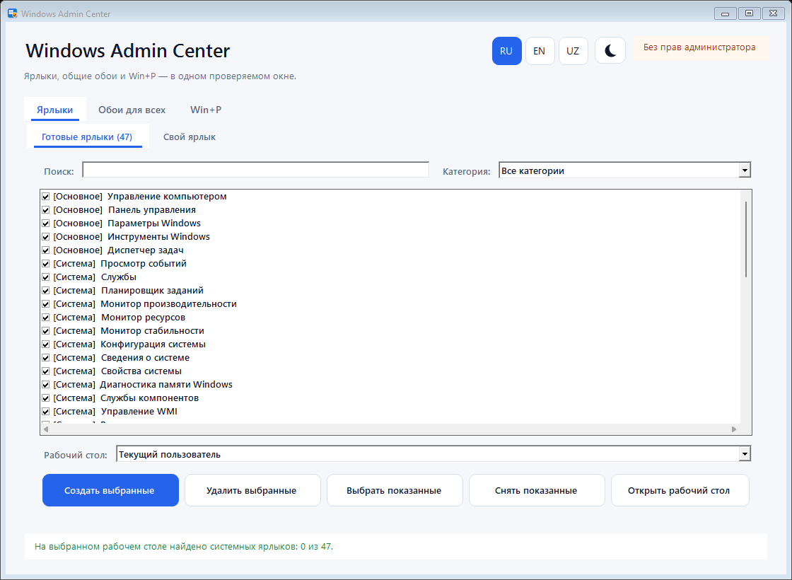
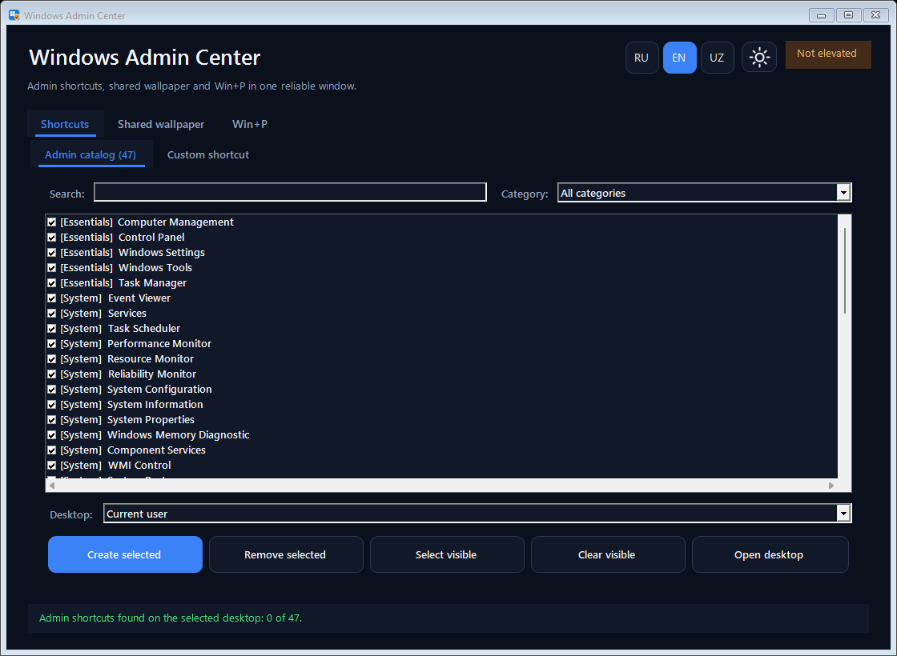
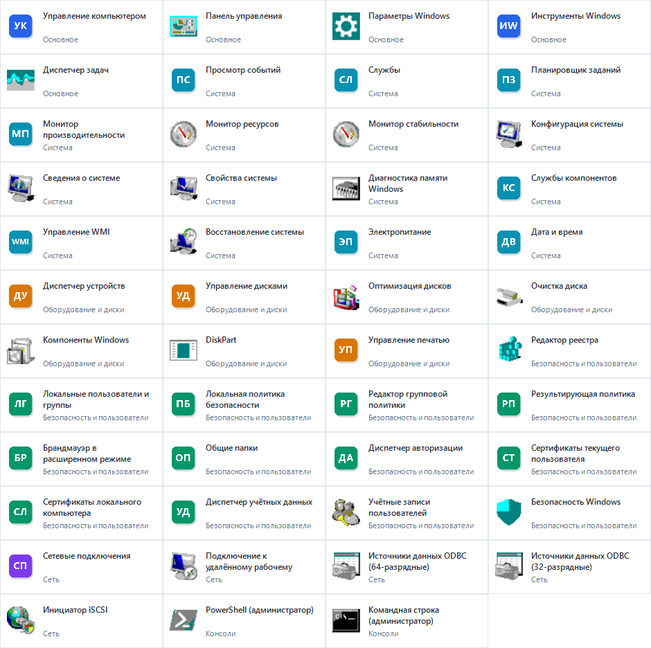
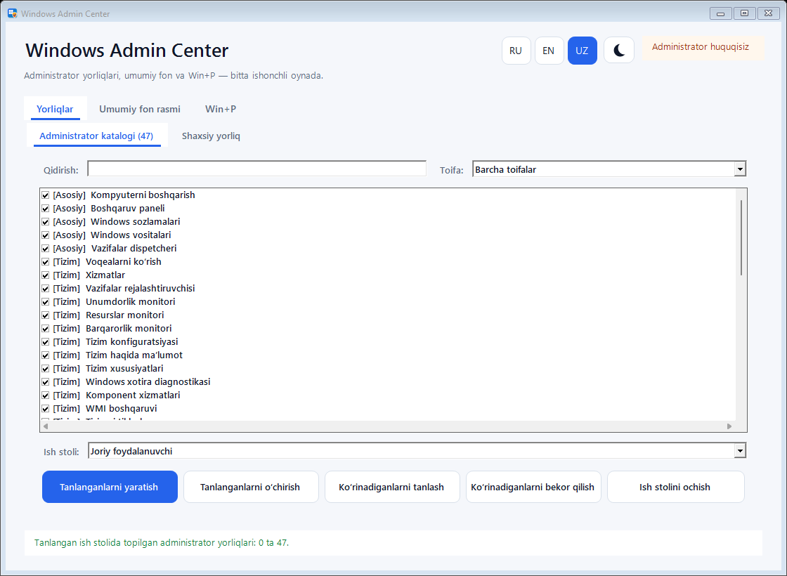

# Windows Admin Center

[Русский](#русский) · [English](#english) · [O‘zbekcha](#ozbekcha)





## Русский

Нативное WinForms-приложение для Windows 10/11 с единым графическим окном:

- создаёт готовые системные и произвольные `.lnk`-ярлыки;
- работает с рабочим столом текущего пользователя или общим рабочим столом всех пользователей;
- устанавливает выбранные обои для всех существующих профилей и профиля новых пользователей;
- создаёт проверенный `Win+P.cmd`, который сразу включает режим дублирования экранов через `DisplaySwitch.exe /clone`.

Интерфейс полностью переключается между русским, английским и узбекским языками кнопками `RU`, `EN`, `UZ`. Кнопка с луной включает тёмную тему, кнопка с солнцем возвращает светлую. Выбор сохраняется между запусками. Окно адаптируется к размеру и DPI: каталог занимает основную рабочую область, имеет постоянную вертикальную прокрутку, поиск и фильтр категорий. Готовые и пользовательские ярлыки разнесены по отдельным подстраницам, а кнопки закреплены в независимых ячейках без взаимного наложения.

## Административные ярлыки

Каталог формируется по реальному составу Windows. В него входят доступные на компьютере инструменты из категорий:

- управление компьютером, параметры и панель управления;
- события, службы, задания, производительность, WMI, COM/DCOM, восстановление и диагностика;
- устройства, DiskPart, диски, электропитание, печать и компоненты Windows;
- реестр, пользователи, общие папки, результирующая политика, сертификаты, брандмауэр и безопасность;
- сетевые подключения, RDP, 32- и 64-разрядные ODBC и iSCSI;
- PowerShell и командная строка с повышенными правами;
- установленные серверные роли: Hyper-V, IIS, DNS, DHCP, Active Directory, ADSI, DFS, NPS, RRAS, GPMC и кластеры.

Отсутствующие оснастки не попадают в список и не создают битые ярлыки. EXE/CPL используют фактические Shell-иконки Windows. Для MMC-оснасток приложение создаёт собственные читаемые 256×256 ICO-бейджи вместо нестабильных индексов ресурсов и пустых generic-иконок.



## Безопасность системных изменений

Приложение запрашивает права администратора через UAC. Для общих обоев оно:

1. проверяет изображение;
2. копирует его в `%ProgramData%\WindowsAdminShortcuts\Wallpapers`;
3. сохраняет исходные значения профилей в `%ProgramData%\WindowsAdminShortcuts\Backups`;
4. применяет изменения ко всем доступным `NTUSER.DAT`;
5. откатывает уже изменённые профили, если один из профилей завершился ошибкой.

Для текущего пользователя новые обои применяются сразу. Остальные пользователи увидят их при следующем входе в Windows.

## Win+P

Файл `Win+P.cmd` содержит прямой вызов штатного `%SystemRoot%\System32\DisplaySwitch.exe /clone`. При запуске он сразу выбирает режим **Дублировать**, не открывая панель проекции. Скрипт записывается с Windows-окончаниями строк `CRLF`; это проверяется локальными тестами и GitHub Actions.

## Скачать готовый EXE

1. Открой вкладку **Actions**.
2. Выбери последний успешный запуск `Build Windows application`.
3. Скачай артефакт `WindowsAdminShortcuts-win-x64`.
4. Распакуй архив. В комплекте находятся `WindowsAdminShortcuts.exe`, `Start-WindowsAdminShortcuts.bat` и `LICENSE.txt`.
5. Запусти EXE или BAT, подтверди UAC и прими лицензию AS IS при первом запуске.

### Использование

1. Выбери язык кнопками `RU`, `EN` или `UZ`, а тему — кнопкой солнца/луны.
2. На вкладке ярлыков отметь нужные инструменты, выбери рабочий стол и нажми **Создать выбранные**.
3. Для собственного ярлыка открой подстраницу **Свой ярлык**, укажи цель и параметры запуска.
4. Для общих обоев выбери JPG/PNG/BMP, способ размещения и подтверди изменение всех профилей.
5. На вкладке `Win+P` создай скрипт **Дублировать** для текущего или общего рабочего стола.

## Локальная сборка

Требуется .NET 8 SDK:

```powershell
.\build.ps1
```

Готовый пакет появится в `dist`.

## Проверки

```powershell
dotnet run --project tests\WindowsAdminShortcuts.Tests\WindowsAdminShortcuts.Tests.csproj --configuration Release
```

Проверяются полный доступный каталог, создание и обратное чтение всех `.ico` и `.lnk`, UAC-флаги, контракт `Win+P.cmd`, CRLF launcher-файлов, стили обоев, UAC-manifest, лицензия AS IS, настройки RU/EN/UZ и светлой/тёмной темы, поиск и прокрутка каталога, отсутствие пересечений элементов при минимальном размере и масштабах 125/150%, а также единственный WinForms entrypoint.

## Автор

True Immortal. Все права сохранены за автором.

Полные условия: [LICENSE.txt](LICENSE.txt).

---

## English

Windows Admin Center is a native Windows 10/11 WinForms application with one
clear administrative window. It:

- creates a curated catalog of Windows administration `.lnk` shortcuts;
- creates custom shortcuts on the current or public desktop;
- applies one wallpaper to existing profiles and the default profile for new users;
- creates a verified `Win+P.cmd` that selects Duplicate through
  `DisplaySwitch.exe /clone`.

The complete interface switches instantly between Russian, English, and Uzbek
with visible `RU`, `EN`, and `UZ` buttons. The moon button enables dark mode;
the sun button returns to light mode. Both preferences persist between runs.
The layout is DPI-aware, scrollable, searchable, and designed to prevent
controls from overlapping at compact sizes.

### Administrative shortcut catalog

The catalog is built from tools that actually exist on the current Windows
installation. It covers Computer Management, Control Panel, Event Viewer,
Services, Task Scheduler, performance and reliability tools, WMI, devices,
disks, registry, local users and policy, certificates, firewall, networking,
RDP, ODBC, iSCSI, elevated consoles, and installed server roles such as
Hyper-V, IIS, DNS, DHCP, Active Directory, DFS, NPS, RRAS, GPMC, and clustering.

Missing snap-ins are omitted instead of producing broken links. EXE and CPL
targets use their real Windows Shell icons. MMC shortcuts receive stable,
readable 256×256 ICO badges instead of fragile resource indices.

### Download and run

1. Open the repository’s **Actions** tab.
2. Open the latest successful `Build Windows application` run.
3. Download `WindowsAdminShortcuts-win-x64`.
4. Extract `WindowsAdminShortcuts.exe`, `Start-WindowsAdminShortcuts.bat`, and
   `LICENSE.txt`.
5. Run the EXE or BAT, approve UAC, and accept the AS IS agreement on first run.

### Usage

1. Choose `RU`, `EN`, or `UZ`; use the sun/moon button for the theme.
2. On **Shortcuts**, select tools and the destination desktop, then choose
   **Create selected**.
3. Use **Custom shortcut** to select any supported target and optional arguments.
4. On **Shared wallpaper**, choose an image and layout, then confirm the
   all-profile operation. A registry backup is created before changes.
5. On `Win+P`, create the Duplicate launcher for the current or public desktop.

The wallpaper transaction stores the managed image in
`%ProgramData%\WindowsAdminShortcuts\Wallpapers` and backups in
`%ProgramData%\WindowsAdminShortcuts\Backups`. If a profile fails, already
changed profiles are rolled back.

### Local build and tests

.NET 8 SDK is required:

```powershell
.\build.ps1
```

Run the verification suite:

```powershell
dotnet run --project tests\WindowsAdminShortcuts.Tests\WindowsAdminShortcuts.Tests.csproj --configuration Release
```

Copyright 2026 True Immortal. All rights reserved. See
[LICENSE.txt](LICENSE.txt) for the complete AS IS terms.

---

## O‘zbekcha



Windows Admin Center — Windows 10/11 uchun bitta tushunarli ma’muriy oynaga ega
mahalliy WinForms dasturi. U:

- Windows boshqaruv vositalari uchun tayyor `.lnk` yorliqlar yaratadi;
- joriy yoki umumiy ish stolida shaxsiy yorliqlar yaratadi;
- mavjud profillar va yangi foydalanuvchilar standart profiliga bitta fon
  rasmini qo‘llaydi;
- `DisplaySwitch.exe /clone` orqali Takrorlash rejimini tanlaydigan tekshirilgan
  `Win+P.cmd` faylini yaratadi.

Butun interfeys `RU`, `EN`, `UZ` tugmalari orqali rus, ingliz va o‘zbek tillari
orasida darhol almashadi. Oy tugmasi qorong‘i mavzuni, quyosh tugmasi yorug‘
mavzuni yoqadi. Til va mavzu keyingi ishga tushirish uchun saqlanadi. Oyna DPI
masshtabiga moslashadi, katalogda qidiruv, toifa filtri va doimiy aylantirish
mavjud; ixcham o‘lchamda boshqaruv elementlari ustma-ust tushmaydi.

### Administrator yorliqlari katalogi

Katalog ayni Windows tizimida haqiqatda mavjud vositalardan tuziladi. Unda
Kompyuterni boshqarish, Boshqaruv paneli, Voqealarni ko‘rish, Xizmatlar,
Vazifalar rejalashtiruvchisi, unumdorlik va barqarorlik vositalari, WMI,
qurilmalar, disklar, reyestr, mahalliy foydalanuvchilar va siyosatlar,
sertifikatlar, xavfsizlik devori, tarmoq, RDP, ODBC, iSCSI, administrator
konsollari hamda o‘rnatilgan Hyper-V, IIS, DNS, DHCP, Active Directory, DFS,
NPS, RRAS, GPMC va klaster rollari mavjud.

Mavjud bo‘lmagan konsollar ro‘yxatga kiritilmaydi, shuning uchun buzilgan
yorliqlar yaratilmaydi. EXE va CPL vositalari Windows Shell ikonalaridan
foydalanadi. MMC yorliqlari beqaror resurs indekslari o‘rniga o‘qiladigan,
barqaror 256×256 ICO belgilarini oladi.

### Yuklab olish va ishga tushirish

1. Repozitoriyning **Actions** bo‘limini oching.
2. Oxirgi muvaffaqiyatli `Build Windows application` ishini tanlang.
3. `WindowsAdminShortcuts-win-x64` artefaktini yuklab oling.
4. `WindowsAdminShortcuts.exe`, `Start-WindowsAdminShortcuts.bat` va
   `LICENSE.txt` fayllarini arxivdan chiqaring.
5. EXE yoki BAT faylini ishga tushiring, UAC so‘rovini tasdiqlang va birinchi
   ishga tushirishda AS IS litsenziyasini qabul qiling.

### Foydalanish

1. `RU`, `EN` yoki `UZ` tilini tanlang; mavzu uchun quyosh/oy tugmasini bosing.
2. **Yorliqlar** bo‘limida vositalar va ish stolini tanlab,
   **Tanlanganlarni yaratish** tugmasini bosing.
3. **Shaxsiy yorliq** bo‘limida maqsad fayli va kerakli argumentlarni kiriting.
4. **Umumiy fon rasmi** bo‘limida rasm va joylashuvni tanlab, barcha profillar
   uchun amalni tasdiqlang. O‘zgarishdan oldin reyestr zaxirasi yaratiladi.
5. `Win+P` bo‘limida joriy yoki umumiy ish stoli uchun Takrorlash skriptini
   yarating.

### Mahalliy yig‘ish va tekshirish

.NET 8 SDK kerak:

```powershell
.\build.ps1
```

Testlar:

```powershell
dotnet run --project tests\WindowsAdminShortcuts.Tests\WindowsAdminShortcuts.Tests.csproj --configuration Release
```

Copyright 2026 True Immortal. Barcha huquqlar himoyalangan. To‘liq AS IS
shartlari [LICENSE.txt](LICENSE.txt) faylida.
